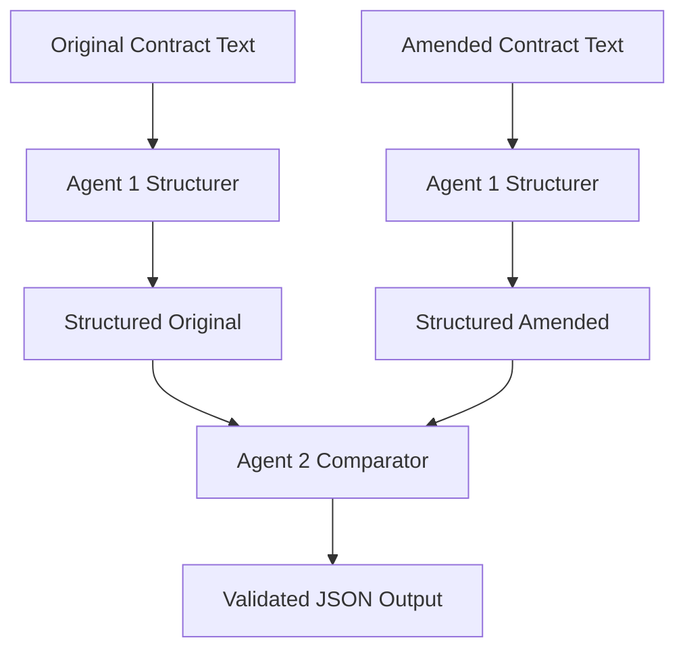
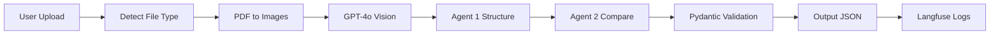

# LegalMove – Autonomous Contract Comparison System

## Overview
This application is an AI-powered Streamlit platform for automated comparison between an original contract and its amended version (adenda). It processes PDFs and images using GPT-4o Vision, structures contracts via specialized agents, identifies legal modifications, and outputs validated JSON summaries. Full observability is provided through Langfuse.

---

## Features

### 🔍 Document Upload & Parsing
- Supports **PDFs** (multi-page) and **images** (JPG/PNG/WEBP)
- PDF pages are converted to images using **PyMuPDF**
- Each page is parsed using **GPT-4o Vision** for accurate text extraction

### 🧠 Two-Agent Architecture

#### Agent 1 – Contract Structurer
- Identifies clauses
- Assigns clause IDs and titles
- Normalizes document structure

#### Agent 2 – Contract Comparator
- Compares structured versions
- Detects modified, added, or removed clauses
- Generates legal impact summaries

### 🧱 Pydantic Validation
Ensures output JSON is:
- Schema-compliant
- Machine-readable
- Safe for production ingestion

### 📊 Langfuse Monitoring
Every step is traced:
- Vision parsing
- Agent executions
- Validation stage
- Final report

---

## System Architecture Diagram

```mermaid
graph TD
    A[Streamlit UI] --> B[File Handling]
    B --> C[PDF → Images (PyMuPDF)]
    C --> D[GPT-4o Vision Parsing]
    D --> E[Agent 1 - Structurer]
    E --> F[Agent 2 - Comparator]
    F --> G[Pydantic JSON Output]
    G --> H[Langfuse Tracing]
```

---

## Agent Workflow Diagram



---

## Flow Diagram (End-to-End)



---

## Installation

### 1. Create environment
```bash
python -m venv .venv
source .venv/bin/activate   # Mac/Linux
.venv\\Scripts\\activate      # Windows
```

### 2. Install dependencies
```bash
pip install -r requirements.txt
```

### 3. Add `.env` file
```env
OPENAI_API_KEY=your_key
LANGFUSE_PUBLIC_KEY=...
LANGFUSE_SECRET_KEY=...
LANGFUSE_HOST=https://cloud.langfuse.com
```

### 4. Run the application
```bash
streamlit run app.py
```

---

## Project Structure

```bash
├── app.py               # Main application
├── README.md            # Documentation
├── requirements.txt     # Dependencies
└── .env                 # Environment secrets
```

---

## Notes
This system is designed as a foundation for a production-grade legal automation platform. It can be extended with:
- LangGraph for autonomous multi-agent workflows
- RAG for legal clause embeddings
- FastAPI backend
- Database storage for contract histories

---

## License
Internal use only unless explicitly licensed.

